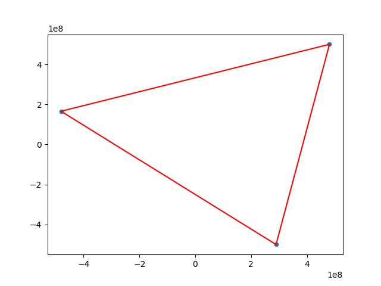
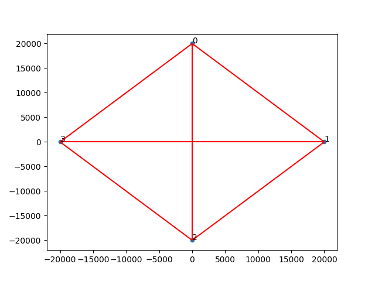
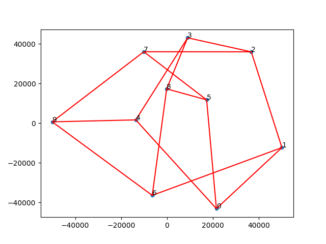
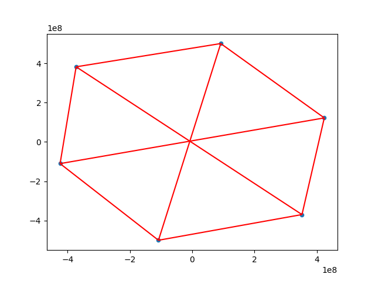
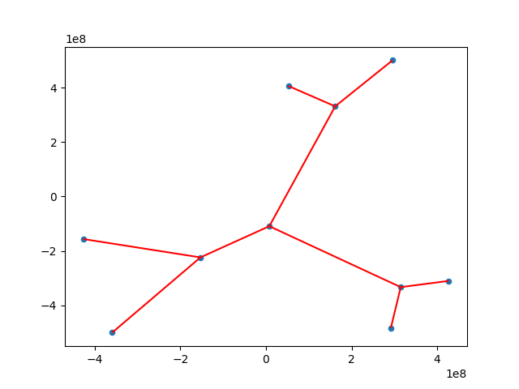
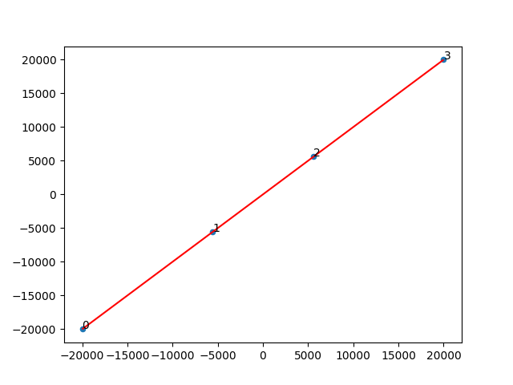
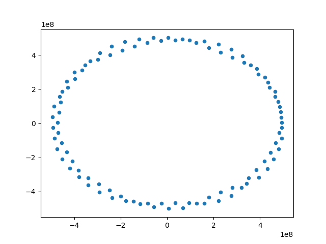
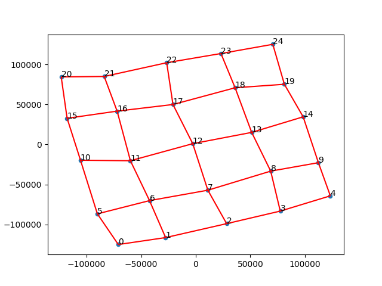
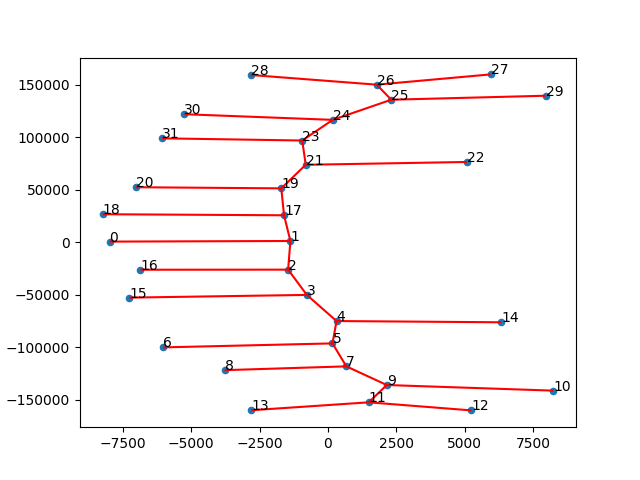
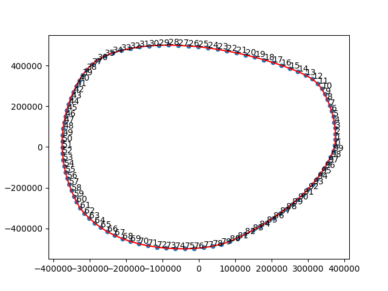

# Graph Visualization

## Introduction

This tool can be used to visualize an undirected simple graph.

The algorithm is based on a force-directed method and simulated annealing, called Fruchterman-Reingold.

#### Reference

-   https://dcc.fceia.unr.edu.ar/sites/default/files/uploads/materias/fruchterman.pdf

## Run

1.   Please install `matplotlib` first.
2.   Run the bash script.

```shell
./visualization.sh [InputFile] [OutputCoordinationFile] [OutputImageFile]
```

For example

```shell
./visualization.sh benchmark/input1.txt output1.txt output1.png
```

#### Input Format

The first line should contain two integer $n$ and $m$, where $n$ should less than 1000.

In $2 \sim m + 1$ lines, each line should contain two integer $a$ and $b$, where $0 \le a, b < n$.

```
n m
a1 b1
a2 b2
...
am bm
```

## Result
| id | type | image |
|:---:|:---:|:---:|
| 1 | $C_3$ |  |
| 2 | $K_4$ |  |
| 3 | Petersen Graph |  |
| 4 | $K_{3,3}$ |  |
| 5 | Tree |  |
| 6 | Bamboo |  |
| 7 | $K_5$ |  |
| 8 | 100 isolated nodes |  |
| 9 | Grid |  |
| 10 | Caterpillar tree |  |
| 11 | $C_{200}$ |  |

