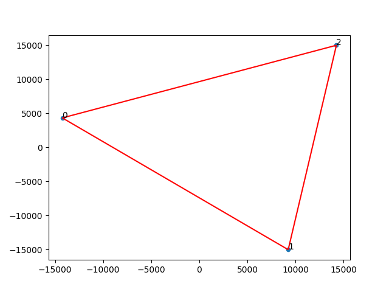
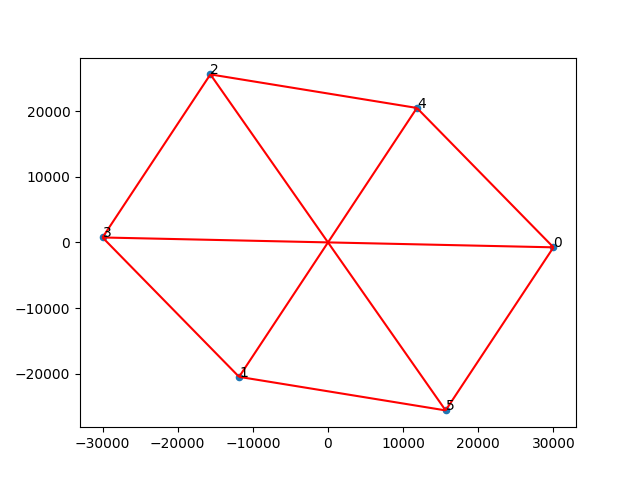
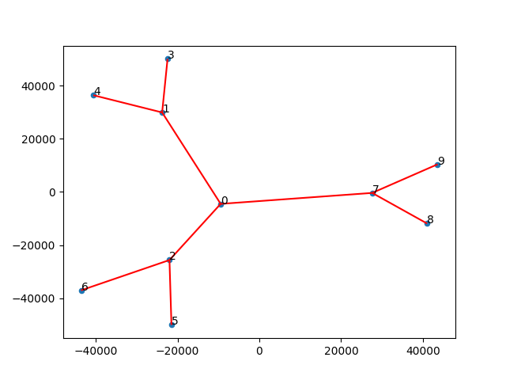
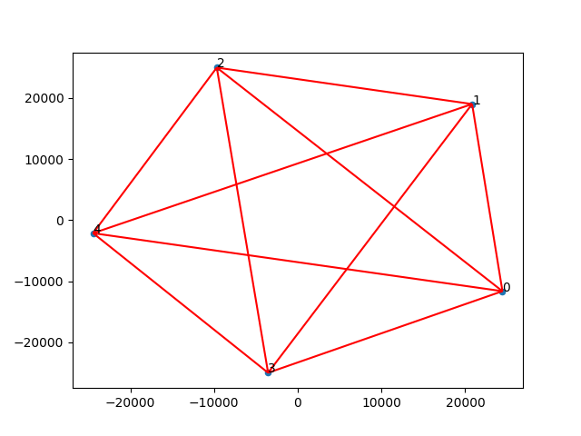
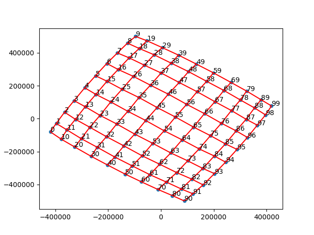
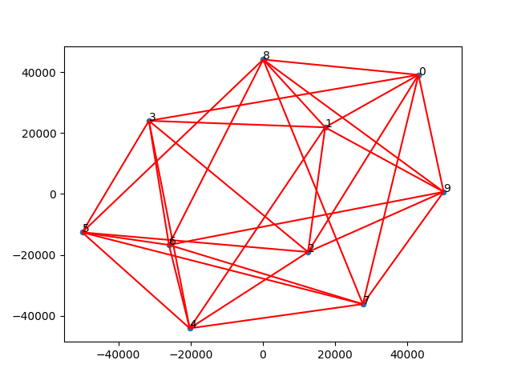

# Graph Visualization

## Introduction

This tool can be used to visualize an undirected simple graph.

The algorithm is based on a force-directed method and simulated annealing, called Fruchterman-Reingold.

#### Reference

-   https://dcc.fceia.unr.edu.ar/sites/default/files/uploads/materias/fruchterman.pdf

## Environment

macOS

## Run

Please install `matplotlib` first.

### Method 1.
Run the bash script.

```shell
./visualization.sh [InputFile]
```

For example

```shell
./visualization.sh benchmark/input1.txt
```

### Method 2.

```shell
make
python3 draw.py <[InputFile]
make clean
```


### Input Format

The first line should contain two integer $n$ and $m$, where $n$ should less than 1000.

In $2 \sim m + 1$ lines, each line should contain two integer $a$ and $b$, where $0 \le a, b < n$.

```
n m
a1 b1
a2 b2
...
am bm
```

## Python API

```python
fruchterman_reingold.Visualization(numNode, numEdge, Edges)
```

- `numNode`: number of nodes
- `numEdge`: number of edges
- `Edges`: a list of edges, each edge is a list of two indices of node


## Result
| id | type | image |
|:---:|:---:|:---:|
| 1 | $C_3$ |  |
| 2 | $K_4$ |  |
| 3 | Petersen Graph |  |
| 4 | $K_{3,3}$ |  |
| 5 | Tree |  |
| 6 | Bamboo |  |
| 7 | $K_5$ |  |
| 8 | 100 isolated nodes |  |
| 9 | Grid |  |
| 10 | Grid |  |
| 11 | Caterpillar tree |  |
| 12 | 5-regular |  |
| 13 | $C_{200}$ |  |

